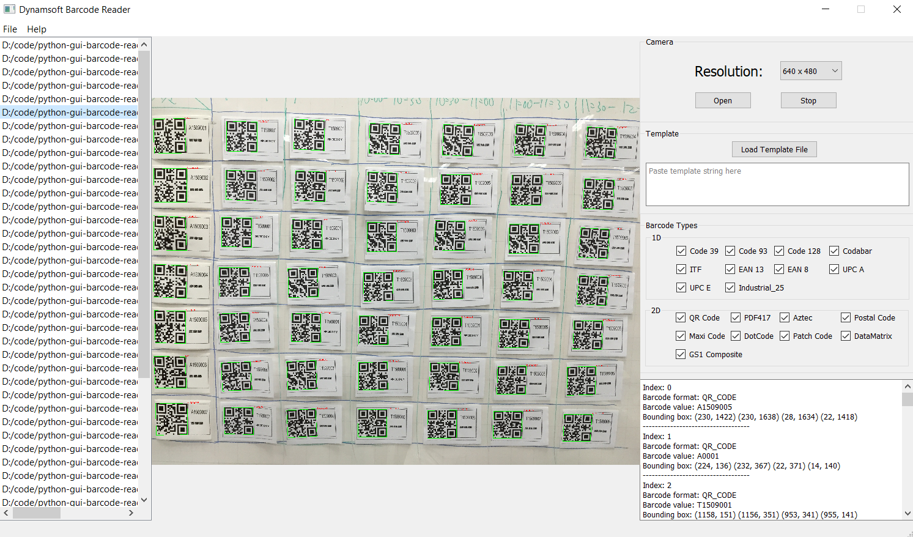

# Python GUI Barcode Reader

[](https://travis-ci.com/github/Dynamsoft/python-gui-barcode-reader)

This is a `cross-platform` GUI barcode reader implemented with `Python 3`, `PyQt`, and [Dynamsoft Python Barcode SDK](https://www.dynamsoft.com/barcode-reader/programming/python/). You can use it on `Windows`, `Linux`, `macOS` and `Raspberry Pi OS`.

## Requirements
- PIL
    ```
    python3 -m pip install pillow
    ```
- OpenCV

    ```
    python3 -m pip install opencv-python
    ```
- Dynamsoft Barcode Reader

    ```
    python3 -m pip install dbr
    ```
- PySide2
    - Windows, Linux and macOS

        ```
        python3 -m pip install PySide2
        ```

    - Raspberry Pi OS

        ```
        apt-get install python3-pyside2.qt3dcore python3-pyside2.qt3dinput python3-pyside2.qt3dlogic python3-pyside2.qt3drender python3-pyside2.qtcharts python3-pyside2.qtconcurrent python3-pyside2.qtcore python3-pyside2.qtgui python3-pyside2.qthelp python3-pyside2.qtlocation python3-pyside2.qtmultimedia python3-pyside2.qtmultimediawidgets python3-pyside2.qtnetwork python3-pyside2.qtopengl python3-pyside2.qtpositioning python3-pyside2.qtprintsupport python3-pyside2.qtqml python3-pyside2.qtquick python3-pyside2.qtquickwidgets python3-pyside2.qtscript python3-pyside2.qtscripttools python3-pyside2.qtsensors python3-pyside2.qtsql python3-pyside2.qtsvg python3-pyside2.qttest python3-pyside2.qttexttospeech python3-pyside2.qtuitools python3-pyside2.qtwebchannel python3-pyside2.qtwebsockets python3-pyside2.qtwidgets python3-pyside2.qtx11extras python3-pyside2.qtxml python3-pyside2.qtxmlpatterns python3-pyside2uic
        ```

## Dynamsoft Barcode SDK License
Apply for a [free trial license](https://www.dynamsoft.com/customer/license/trialLicense) and save it to `license.txt`.

## Usage

- Simple demo:

    ```
    python3 app.py license.txt
    ```

    

- Advanced demo supports reading barcodes from image file, webcam and desktop screenshot:

    ```
    pyside2-uic design.ui -o design.py
    python3 app_advanced.py license.txt
    ```

    

    
## Blog
- [How to Scan QR Code from Desktop Screen in Python](https://www.dynamsoft.com/codepool/scan-qr-code-from-desktop-screen.html)
- [Advanced GUI Barcode Reader for Windows, Linux, macOS and Rasberry Pi OS](https://www.dynamsoft.com/codepool/gui-barcode-reader-windows-linux-macos.html)
